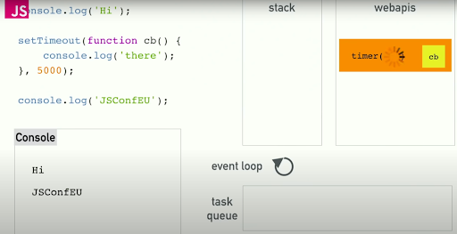
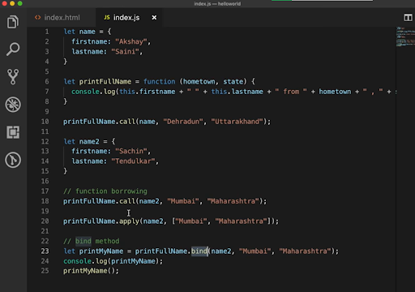
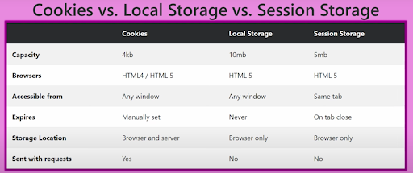
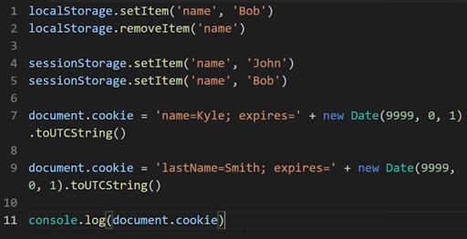
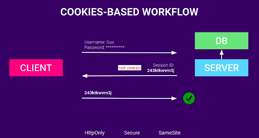
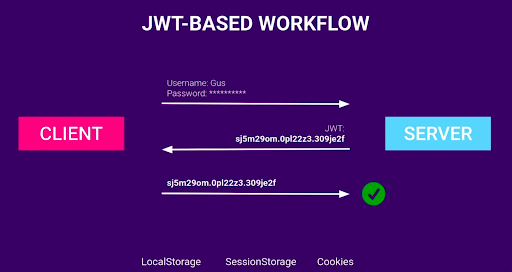

`What is useMemo?`

useMemo is used to increase the performance of a React application by memoizing (caching) the result of an expensive
computation. Basically, when the component is rerendered, all the functions and variables inside it are recreated. So,
to eliminate the recomputation of the function we use useMemo. useMemo basically caches the value and returns the same
value every time, only when some change happens in the dependency array the function gets called. It then returns a new
value based on the computation. We cannot use useMemo everytime because it uses memory space for caching the value and
also we can face some performance issues.

useMemo is also used for referential equality problems. Because arrays, objects, and function references are again
created when the component is rerendered and if their value is declared in a useEffect dependency array then the
useEffect function will be called whenever the component is rerendered.

Example

```js
import React, { useMemo, useState } from "react"

function ExpensiveComponent({ number }) {
  const factorial = (n) => {
    console.log("Calculating Factorial...")
    return n <= 1 ? 1 : n * factorial(n - 1)
  }

  const computedFactorial = useMemo(() => factorial(number), [number])

  return (
    <div>
      Factorial of {number}: {computedFactorial}
    </div>
  )
}

const ComponentTesting = () => {
  const [number, setNumber] = useState(0)
  return (
    <>
      <button onClick={() => setNumber(1)}>Set Number</button>
      <ExpensiveComponent number={2} />
    </>
  )
}

export default ComponentTesting
```

```js
Referencial Equality
const obj = useMemo(() => {
  return { fruit: "apple" }
}, [])
This obj now can be used in a useEffect function
```

`What is useCallback?`

useCallback is very similar to useMemo. Because it is also used for performance optimization. The only main difference
is that useMemo returns a value that is returned from the callback function and useCallback returns the callback
function that is declared inside it. useCallback memoizes the whole function. Normally, when a React component
rerenders, any function declare inside it gets recreated. This can cause unnecessary rerenders in child components if
that function is passed as a prop. useCallback prevents this by returning the same function reference unless its
dependencies change.

Example

```js
const returnedFunction = useCallback(()=>{some operation},
[value]);
```

`What is Pure Component?`

Pure Component is used for performance optimization and it is used to limit the rerendering of the component. A Pure
Component automatically implements shouldComponentUpdate(), which performs a shallow comparison of state and props. If
the parent component rerenders and the props passing to it are not changed the component will not rerender also if the
setState is called and the new state is same as previous it will also not called. It is used in class-based components.

Example

```js
class Example extends PureComponent {}
```

`What if we call useEffect without a dependency array?`

If there is no dependency array then the useEffect will be called everytime when there is a change in state and props.

`What is props drilling?`

Props drilling is passing the data through several nested components. Like the data is passing from grandparent to
parent and parent to child component. The problem with this approach is that the components that lie inbetween are only
used as a medium to pass the data and they don’t actually need the data. To escape from this approach we can use
useContext and Redux.

`Difference between Redux Saga and Redux Thunk?`

Redux Saga

Yield basically replicating async/await such that it wait for the response from the API. There is a lot of boilerplate
code for the setup. Call is used to call the method. Put is used to put the data in the dispatch function.

Redux Thunk

Redux Thunk is a middleware that helps Redux work with asynchronous tasks like fetching data from an API.

Normally, Redux only allows synchronous actions, meaning actions that return plain objects. But sometimes, we need to
wait for something (like getting data from a server) before updating the Redux store.

Redux Thunk solves this problem by allowing action creators to return a function instead of an action object. This
function can wait, fetch data, and then dispatch actions when ready.

Example

```js
const signIn = (email, password) => async (dispatch, getState) => {
  console.log("state= ", getState())
  dispatch({ type: SET_LOGIN_DATA, payload: data })
}
```

The main difference between Saga and Thunk is that in Saga there is a lot of boilerplate code but in Thunk boilerplate
code is less. Secondly, in Saga the code in middleware is cleaner. But, in Thunk if we have more API calls in a single
middleware the code is not cleaner.

`Why do we use Redux instead of useContext?`

We use Redux because useContext can be very complex for larger applications and there can be performance issues if we
change the data frequently in useContext state. For smaller applications and for smaller changes useContext can be good.

`What is SDLC?`

SDLC stands for software development life cycle. It consists of three main stages.

1. Requirement Gathering Stage
2. Development Stage
3. Maintainance Stage

It contains all steps from the beginning of software and to the end of it.

`What is Hoisting?`

In hoisting the _interpreter_ moves the declaration of variables and functions to the top of the scope in which they are
defined, before the execution of the code. Also functions are hoisted completely. The whole definition/ declaration goes
to the top of the scope.

Example

```js
x = 7
console.log(x)
var x // this line goes to the top
```

There's a difference in how var, let, and const behave:

var is hoisted and initialized with undefined, so you can use it before the actual declaration.

let and const are hoisted but not initialized with undefined, so if you try to use them before they are declared, you'll
get a ReferenceError. This period where they exist but can't be used is called the _Temporal Dead Zone_ (TDZ).

Example

```js
console.log(x) // Undefined (because var is hoisted)
var x = 10
console.log(y) // Reference Error! (y is in the TDZ)
let y = 20
```

`Function Definition/ Declaration`

```js
function square(num) {
  return num * num
}
```

`Function Expression` A function is created and assinged to a variable.

```js
const square = function (num) {
  return num * num
}
```

`Difference between Var, Const and Let?`

Scope

A scope is like a container that defines where a variable can be accessed in your code.

Var

var is function scoped and anywhere it is defined in the function you can use it. If it is not defined in a function, it
acts as a global scope. Also, you can redeclare the variable using var in the same scope.

```js
var myVariable = 1
var myVariable = 2
```

Const and Let

const and let are block scoped. They cannot be redeclared in the same scope. In const you cannot reinitialize the same
variable.

`Difference between Mutable and Immutable values?`

Mutable values are those which can be modified after creation. Immutable values are those which cannot be modified after
creation.

`Difference between Primitive and Non-Primitive Data-Types?`

There are two data types in JS.

Primitive Data-Types

String, Number, Boolean, Null and Undefined, Symbol and BigInt.

Non-Primitive Data-Types

Objects (Complex data-structure with a collection of properties and methods) All Javascript values except Primitive
values are objects.

Also, the fundamental difference between Primitive and Non-Primitive values is that Primitive values are Immutable and
Non-Primitive values are Mutable. Primitive values are stored by value while Non-Primitive values (objects) are stored
by reference. It is important to note here that the Primitive values are reassinged to a new value and the existing
value is replaced not changed.

Example

```js
let str = "Hello"
str[0] = "Y"
console.log(str) // ❌ Still "Hello" (does NOT change)

// But this will work

let str = "Hello".split("")
str[0] = "Y"
console.log(str)
```

`What is This?`

This refers to the object that is calling the _current function_. If it is declared inside a method of an object then it
points towards the object in which it is declared.

Example

```js
const person = {
  name: "Alice",
  greet: function () {
    console.log(this.name) // ✅ "this" refers to "person"
  }
}

person.greet() // Output: Alice
```

Incase of arrow functions

```js
const person = {
  name: "Alice",
  greet: () => {
    console.log(this.name) // ❌ "this" does NOT refer to "person" object
  }
}
person.greet() // Output: undefined (or window in browsers)
```

And if it is not declared inside an object then it points towards the global window object.

`What is HOC`?

A Higher Order Component is a function which takes a component as an input and returns a new modified component. HOC is
used for code reusability such that you don’t have to write the same exact code for multiple components and you put the
repeated logic in HOC and main logic in the component which is given as input to HOC.

Example

```js
import React from "react"

// 1. HOC function
function withGreeting(WrappedComponent) {
  return (props) => (
    <div>
      <p>Hello! 👋</p>
      <WrappedComponent {...props} />
    </div>
  )
}

// 2. Simple component
const Message = ({ text }) => <p>{text}</p>

// 3. Wrap the component with HOC
const MessageWithGreeting = withGreeting(Message)

// 4. Usage
export default function App() {
  return <MessageWithGreeting text="This is a message." />
}
```

Some Common Examples WithRouter, withTheme.

`Difference between IndexOf and findIndex?`

IndexOf expects a value as the first parameter and returns the index of a value. This makes it a good choice to find the
index in arrays of primitive types (like string, number, or boolean).

findIndex expects a callback as the first parameter. Use this if you need the index in arrays with non-primitive types
(e.g. objects) or your find condition is more complex than just a value.

```js
const arr = [1, 2, 3, 4, 5]
const arrOfObjects = [
  { id: 1, name: "John" },
  { id: 2, name: "Jane" },
  { id: 3, name: "Jim" }
]

const indexFound = arr.indexOf(2)

const objectFound = arrOfObjects.findIndex((obj) => obj.id === 2)
console.log("indexFound= ", indexFound)
console.log("objectFound= ", objectFound)
```

`What are Callbacks, Promises, and Async/Await?`

`Callbacks`

Callbacks are used to handle asynchronous code. A callback is a function that is passed as an argument to another
function and is executed after that outer function has finished its execution. However, using many nested callbacks can
become difficult to manage and read, leading to a problem known as `callback hell`.

Example

```js
const firstFunction = (callback) => {
  console.log("First function called.")
  callback(true)
}

const secondFunction = (callback) => {
  console.log("Second function called.")
  setTimeout(() => {
    callback()
  }, 1000)
}

const thirdFunction = () => {
  console.log("Third function called.")
}

firstFunction((res) => {
  if (res) {
    secondFunction(() => {
      thirdFunction()
    })
  }
})
```

`Promises`

Promises are also used to handle asynchronous code introduced in ES6. Basically, they are objects which promises to
return something in every case. Promise takes two parameters resolve and reject. Resolve results into the then block
while reject results into the catch block.

Example

```js
const greet = new Promise((resolve, reject) => {
  setTimeout(() => {
    let result = true
    if (result) {
      resolve("Hi, my name is ali imran")
    } else reject("Promise not resolved")
  }, 1000)
})

greet
  .then((response) => {
    console.log("response= ", response)
  })
  .catch((error) => {
    console.log("error= ", error)
  })
```

Example

```js
const firstFunction = () => {
  console.log("First function called.")
  return new Promise((resolve, reject) => {
    resolve(true)
  })
}

const secondFunction = () => {
  console.log("Second function called.")
  return new Promise((resolve, reject) => {
    setTimeout(() => {
      resolve()
    }, 1000)
  })
}

const thirdFunction = () => {
  console.log("Third function called.")
}

// simple approach
firstFunction().then((response) => {
  if (response) {
    secondFunction().then(() => {
      thirdFunction()
    })
  }
})

// promise chaining
firstFunction()
  .then((res) => {
    if (res) {
      return secondFunction()
    }
  })
  .then(() => {
    thirdFunction()
  })
  .catch((err) => {
    console.log("error= ", error)
  })
```

`States of a Promise`

A Promise has four states:

1. Fulfilled: Action related to the promise succeeded.
2. Rejected: Action related to the promise failed.
3. Pending: Promise is still pending, i.e., not fulfilled or rejected yet.
4. Settled: The Promise has been fulfilled or rejected.

`Promise Combinators`

Promise.all

Promise.all takes an array of Promises and in return, it gives another array of resolved Promises which it will run in
parallel. Where it will only succeed if and only if all the Promises gets resolved.

```js
Promise.all([firstFunction(), secondFunction(), thirdFunction()])
  .then((response) => {
    console.log("response= ", response)
  })
  .catch((error) => {
    console.log("error= ", error)
  })
```

Promise.all Polyfill

```js
Pconst promiseAllPolyfill = (promises) => {
  let results = [];
  let fulfilledCount = 0;

  return new Promise((resolve, reject) => {
    promises.forEach((promise, index) => {
      promise
        .then((response) => {
          results[index] = response;
          fulfilledCount += 1;

          if (fulfilledCount === promises.length) {
            resolve(results);
          }
        })
        .catch(() => {
          reject(new Error("One of the promises rejected"));
        });
    });
  });
};

Promise.promiseAllPolyfill([firstFunction(), secondFunction()])
```

Promise.race

Promise.race will give the Promise that resolves first but the promise can be a rejected promise.

Promise.any

Promise.any will give the Promise that is fulfilled first and skips the promises that are rejected ones.

Promise.allSettled

Promise.allSettled will provide the status of the promises. Even if any of the Promise gets rejected it will also
provide the status of rejected promise.

```js
response = [
  { status: "fulfilled", value: true },
  { status: "rejected", reason: undefined },
  { status: "fulfilled", value: undefined }
]
```

`Async/ Await`

async/await are also used to handle asynchronous code introduced in ES8. They are simple and easy to write as they
eliminate the chaining of then, catch, and finally block. Async/ await uses promises for asynchronous calls, but they
give a new way to unwrap promises.

Example

```js
const res = await firstFunction()
if (res) {
  await secondFunction()
  thirdFunction()
}
```

`Questions`

Question 1

```js
console.log("start")

const p = new Promise((resolve, reject) => {
  console.log(1) // this is a js sync code part
  resolve(2) // asynchronous operation
})

// this will only be called when resolve or reject is called
p.then((response) => {
  console.log(response)
})

console.log("end")

// output start 1 end 2
```

Question 2

```js
const firstPromise = new Promise((resolve, reject) => {
  resolve("First!")
})

const secondPromise = new Promise((resolve, reject) => {
  resolve(firstPromise)
})

secondPromise
  .then((response) => {
    return response
  })
  .then((response) => {
    console.log(response)
  })

// output First!
```

`How Node JS acts as a multi-threading language?`

JS is a single-threaded, non-blocking, asynchronous language. Asynchronous methods are needed because without them the
browsers can not do anything as they cannot render anything.

In browsers, we have **_web APIs_** for threading purposes for async requests and in NodeJS, we have **_C++ threads/
libuv's worker threads_**.

There are 4 components that are used while processing the code by compiler.

1. CallStack
2. Web Api's/ Node Api's
3. Callback Queue
4. Render Queue
5. Event Loop

Where CallStack is a data structure having the Last In First Out principle, which handles all the synchronous code. Like
our code is wrapped in the main function. So, the main function gets added to the CallStack for the very first time.



So the setTimeout() function is going to execute in the web APIs and when it is complete it is passed to the Callback
Queue. The Event Loop checks the Stack and the Queue. If the Stack is empty it pushes the task to the Stack.

Note:

setTimeout is the minimum time to execution not the guaranteed time to execution.

Callback Queue

The job of the Callback Queue is to maintain a list of all the callback functions that are ready to get executed and
behaves on a First In First Out Principle.

Event Loop

The job of Event Loop is to check either Callback Queue and CallStack is empty or not. If CallStack is empty and there
is items in Callback Queue. Then it throws the items to the CallStack. It is important to note that anything in the
Callback Queue will only run after the execution of the main program.

There is another queue which is the Render Queue and it is given the higher priority. Whenever the CallStack gets empty
the render queue gets called first and it paints the browser with the data.

Reference Link

https://www.youtube.com/watch?v=FVZ-A_Akros

`What is Implicit and Explicit binding?`

Implicit binding occurs when a function is called as a method of an object. In this case, this refers to the object.

In explicit binding, we explicitly set the value of this using call, apply, or bind.

`What is Call, Apply and Bind (explicit binding)`

By using Call, Apply and Bind are used to tie functions with objects.

`Call`

Call directly calls the function and takes the first parameter as a reference to the object and other parameters are all
the additional parameters.

`Apply`

Apply is also similar to the call method. The only difference is that it takes all the additional parameters in the form
of an array.

`Bind`

Bind is similar to call method where the first parameter is the reference to the object and all the other additional
parameters are not taken in an array. The only difference is that it don’t directly calls the method but it returns the
reference to the function which can be call later. It can be called multiple times.



Question 1

```js
const animals = [
  { species: "Lion", name: "King" },
  { species: "Whale", name: "Queen" }
]

function printAnimals(i) {
  this.print = function () {
    console.log("#" + i + " " + this.species + ": " + this.name)
  }
  this.print()
}

animals.forEach((animal, index) => {
  printAnimals.call(animal, index)
})

// Output
// #0 Lion: King
// #1 Whale: Queen
```

Question 2

```js
function f() {
  console.log(this.name)
}

f = f.bind({ name: "Jhon" }).bind({ name: "Ann" })

f()
// Output is Jhon as there is no such thing as bind chaining
```

Question 3

```js
function checkPassword(ok, fail) {
  let password = prompt("Password?", "")
  if (password == "Pa$$w0rd!") ok()
  else fail()
}

let user = {
  name: "Piyush Agarwal",

  login(result) {
    console.log(this.name + (result ? " login successful" : " login failed"))
  }
}
// here bind is returning the reference
checkPassword(user.login.bind(user, true), user.login.bind(user, false))
```

`Bind Function Polyfill`

```js
// Not Important Polyfill

Function.prototype.myBind = function (context = {}, ...args) {
  if (typeof this !== "function") {
    throw new Error("Can only bind functions")
  }

  const originalFn = this

  return function (...newArgs) {
    return originalFn.apply(context, [...args, ...newArgs])
  }
}

function greet(greeting, name) {
  console.log(`${greeting}, ${name}!`)
}

const person = { name: "Alice" }

// Custom bind
const greetPerson = greet.myBind(person, "Hello")
greetPerson("Bob") // Output: Hello, Bob!
```

`Closures`

A closure is a combination of a function bundled together such that the variable defined outside of the inner function
can be accessible inside of the inner function. Where the inner function has access to the scope (lexical scope) of the
outer function. Even though, the outer function has done its execution long ago. Because the outer function saves its
scope items for later use. There are three types of scopes in closures local scope, outer scope, and global scope.

Example

```js
const outerFunction = (outer) => {
  console.log("outer= ", outer)
  return (inner) => {
    console.log("outer= ", outer)
    console.log("inner= ", inner)
  }
}

outerFunction("I am the outer value.")("I am the inner value")
//Output
// outer=  I am the outer value.
// outer=  I am the outer value.
// inner=  I am the inner value
```

Example

```js
// global scope
const e = 10
function sum(a) {
  return function (b) {
    return function (c) {
      // outer functions scope
      return function (d) {
        // local scope
        return a + b + c + d + e
      }
    }
  }
}

console.log(sum(1)(2)(3)(4))
// Output 20
```

Example

```
let count = 0;
(() => {
  if (count === 0) {
    let count = 1 // shadowing
    console.log("count= ", count) // 1
  }
  console.log("count= ", count) // 0
})() // IIFE (Immediate Invoked Function Expression)
```

Example

```js
// Private Counter

function counter() {
  var counter = 0

  function add(num) {
    counter += num
  }

  function retrieve() {
    return counter
  }

  return {
    add,
    retrieve
  }
}

const c = counter()
c.add(10)
c.add(5)

console.log("counter= ", c.retrieve())
```

`Currying`

Currying is a process in which we can transform a function of multiple arguments into a sequence of nested functions.

```js
const sum = (a) => {
  return (b) => {
    if (b) {
      return sum(a + b)
    } else {
      return a
    }
  }
}

console.log(sum(1)(2)())
```

`UseRef`

With useRef we can directly manipulate the realDOM. UseRef does not cause the component to rerender unlike to useState.

Example

```js
//We can calculate to how many times the component rerenders.

const renderCount = useRef(0)
useEffect(() => {
  renderCount.current = renderCount.current + 1
})
```

Example

```js
const inputRef = useRef('');

const refFunc = () => {
    inputRef.current.focus();
    inputRef.current.value = 'Hi I am Ali Imran';
}

<input ref = {inputRef} />
<button onClick = {refFunc}>Click Me</button>
```

`What is Debouncing and Throttling?`

`Debouncing`

Wait until the user stops doing something, then run the function.

```js
const debounceFunction = _.debounce(() => {
  // any type of code
}, 1000)

debounceFunction()

// Debounce Function Polyfill

const myDebounce = (cb, delay) => {
  let timer
  return function (...args) {
    clearTimeout(timer)
    timer = setTimeout(() => {
      cb(...args)
    }, delay)
  }
}
```

`Throttling`

It only executes a function when during an event handling a certain amount of time gets completed.

Question 1

```js
let obj = {
  a: "one",
  b: "two",
  a: "three"
}

console.log("obj= ", obj)
// Output
// obj=  { a: 'three', b: 'two' }
```

````

Question 2

```js
const settings = {
  user: "Ali Imran",
  level: 30,
  health: 20
}

const data = JSON.stringify(settings, ["level", "health"])

console.log("data= ", data) // Output data=  {"level":30,"health":20}
````

Question 3

```js
const user = {
  username: "Ali Imran",
  fullName: {
    first: "Ali",
    last: "Imran"
  }
}

const {
  fullName: { first, last }
} = user // nested destructuring
```

`Explain the React Life Cycle?`

React LifeCycle Methods

Lifecycle methods are mainly used in class components.. These methods can be used to initialize components, update
components based on changes to props or state, and clean up resources when a component is removed from the DOM. Here’s a
breakdown of the key lifecycle methods:

`Mounting`

These methods are called when an instance of a component is being created and inserted into the DOM.

`constructor()`

Called before the component is mounted. Typically used to initialize state and bind event handlers.

```js
constructor(props)
{
  super(props)
  this.state = { count: 0 }
}
```

`componentDidMount()`

Called immediately after a component is mounted (inserted into the Dom). Ideal for initializing things like network
requests or setting up subscriptions.

```js
componentDidMount()
{
  fetch("/api/data")
    .then((response) => response.json())
    .then((data) => this.setState({ data }))
}
```

`Updating`

These methods are called when a component is being rerendered due to changes to props or state.

`shouldComponentUpdate(nextProps, nextState)`

Called before rendering when new props or state are received. Returns true or false, determining whether the component
should rerender.

```js
shouldComponentUpdate(nextProps, nextState)
{
  return nextState.count !== this.state.count
}
```

`componentDidUpdate(prevProps, prevState)`

Called immediately after updating. Can be used to operate on the DOM after the component has been updated, such as
fetching new data when props change.

```js
 componentDidUpdate(prevProps, prevState) {

   if(prevProps.id !== this.props.id) {
     fetch(`/api/data/${this.props.id}`)
     .then(response => response.json())
     .then(data =>
      this.setState({ data })); }}
```

`Unmounting`

This method is called when a component is being removed from the DOM.

`componentWillUnmount()`

Called immediately before a component is unmounted and destroyed. Ideal for cleaning up resources, like invalidating
timers, canceling network requests, or cleaning up subscriptions.

```js
componentWillUnmount() {
  clearInterval(this.timerID);
}
```

Difference between LocalStorage, Session, and Cookies?





`Difference between stateless and stateful architecture?`

Session and cookies enable a `stateful architecture` by storing the session Id on the server side, either in memory,
Redis, or a database, linked to the user's data. When a user requests with their session Id, the server checks if the
session Id exists and retrieves the associated data. Sessions are commonly used on banking websites.
`One of the main benefits of using sessions is that we can set them for a short interval and we can revoke the session at any time.`
And the biggest disadvantage is the scalability of the backend server. And, if the server gets restarted all the users
will get logged out. Also, for the serverless architecture we have to create another session that will maintain the
state so that the data is stored on it. As serverless architecture doesn’t have any state.

In a `stateless architecture`, user-related data is not stored on the server. Instead, when a user is authenticated, the
server generates a JWT (JSON Web Token) and sends it to the front-end, where it is stored on the client-side, typically
in the browser. For any subsequent requests made to the server, the token is attached to the request, allowing the
server to verify the user without needing to maintain session data.

The advantage of the JWT token is that we can set them for a longer time and we are not storing any data on the server.
The disadvantage of this is that it is very difficult to revoke the token and also the token is somewhat less secure as
it can be copied.

`What are types of authentication`

Password-based authentication with Session and Cookies



Password-based authentication with JWT



SSO (single sign-on)

Allows users to log in once to multiple related systems without logging in again. Popular implementations include OAuth,
OpenID Connect, and SAML.

`setTimeout Interview Questions`

Question 1

```js
for (let i = 0; i < 5; i++) {
  setTimeout(() => console.log(i), 0)
}
// OUTPUT = 0 1 2 3 4
```

Description

As let variable creates a block scope. So, each time when the iteration of the loop is changed a new block scope is
created. Now, when the callback function of setTimeout() web api is invoked, the JS engine looks for the value of 'i' in
its execution context. Since the value of 'i' is not there, the JS engine will look for the value of 'i' in its lexical
scope chain.

Question 2

```js
let j = 0
for (j = 0; j < 5; j++) {
  setTimeout(() => console.log(j), 0)
}
// OUTPUT = 5 5 5 5 5
```

If you look at the code, the 'let' variable is created before the 'for' loop. This means that there is no new block
scope created for every iteration. But this block scope is common for the entire 'for' loop.

Question 3

```js
for (var i = 0; i < 5; i++) {
  setTimeout(() => console.log(i), 0)
}
// OUTPUT = 5 5 5 5 5
```

We know that 'var' variable is function or globally scoped. In this case, since we haven't used a function, it is
globally scoped. Because of the 'var' variable, there is no new block scope created in each iteration. Now, when the
callback function of setTimeout() web API is invoked, the JS engine looks for the value of 'i' in its execution context.
Since the value of 'i' is not there, the JS engine will look for the value of 'i' in its lexical scope chain.

To get the same behavior with var

```js
for (var k = 0; k < 5; k++) {
  const test = (k) => {
    setTimeout(() => console.log(k), k * 1000)
  }
  test(k)
}
```

`First Class Functions`

First Class Functions are those functions that can store in a variable and then you can do all the things with the
stored value just like a normal variable.

`Callback (Call me back)`

In callback a function is passed as an agrument to the calling function.

```js
const firstFunction = () => {
  return "Hello"
}

const secondFunction = (callback) => {
  console.log(callback() + " Ali Imran")
}

secondFunction(firstFunction)
```

```js
const nums = [1, 2, 3]

function iteration(item) {
  console.log("item= ", item)
}

const numsMap = nums?.map(iteration)
```

`Difference between arrow functions and normal functions?`

First is the syntax as in the arrow function we have a cleaner syntax and return statement can be used or not. Second
this keyword in the arrow function points to the `global scope` and in the normal function this keyword points to the
`local scope`.

```js
let user = {
  username: "Ali Imran",
  arrowFunc: () => {
    console.log("Hi I am ", this.username)
  },
  normalFunction: function () {
    console.log("Hi I am ", this.username)
  }
}

user.arrowFunc() // undefined Beacause this is pointing to the window object in browser and in Node to empty object.
user.normalFunction() // Ali Imran Because this keyword points to the object who is calling that function
```

`Event Bubbling`

Event bubbling is a process where events trigger from the bottom to the top of the parent. Like Button -> Form -> Div if
all of these have event triggers.

`What is This in JS?`

This keyword is used to reference objects in JS. And everything in JS is objects. This will point to the object who is
calling that function. Outside of objects this will point to the global/window object.

```js
this.val = 5
console.log(this.val)
// where this is window object
```

Question

```js
let user = {
  name: "Muhammad Ali",
  age: 27,
  getDetails() {
    const nestedArrow = () => console.log(this.name)
    nestedArrow()
  }
}

user.getDetails()
```

The arrow function will take the value of this from the parent function which is getDetails() and getDetails() is
getting the value of this from the user object.

Question

```js
const calc = {
  total: 0,
  add(num) {
    this.total += num
    return this
  },
  multiply(num) {
    this.total *= num
    return this
  },
  subtract(num) {
    this.total -= num
    return this
  },
  divide(num) {
    this.total /= num
    return this
  }
}

const result = calc.add(10).multiply(5).subtract(10).divide(2)
console.log("result= ", result.total)
```

`Map Polyfill`

```js
const actualMap = [1, 2, 3].map((item, index, arr) => {
  return item
})
console.log(actualMap)

Array.prototype.map2 = function (cb) {
  let temp = []
  for (let i = 0; i < this.length; i++) {
    temp.push(cb(this[i], i, this))
  }

  return temp
}

const dummyMap = [1, 2, 3].map2((item, index, arr) => {
  return item
})
console.log(dummyMap)
```

`Filter Polyfill`

```js
const actualFilter = [1, 2, 3].filter((item, index, arr) => {
  return item === 2
})
console.log(actualFilter)

Array.prototype.filter2 = function (cb) {
  let temp = []
  for (let i = 0; i < this.length; i++) {
    if (cb(this[i], i, this)) {
      temp.push(this[i])
    }
  }
  return temp
}

const dummyFilter = [1, 2, 3].filter2((item, index, arr) => {
  return item === 2
})
console.log(dummyFilter)
```

`forEach and map`

map return us the new version of the previous array whereas forEach does not return anything. And as it is not returning
an array we can not chain a new array method with it.

`Is JS synchronous or asynchronous?`

JS is synchrounous by default but becomes asynchronous by browser events or Node JS.

`What are blocking and non-blocking I/O?`

A blocking I/O operation is one where the program's execution is halted until the requested operation is fully
completed.

`What is JS execution context and lexical scope?` Execution context is the environment in which the code runs where as
lexical scope means a function can access variables based on where it is written in the code, not where it is called.

```js
let x = 10

function outer() {
  let y = 20

  function inner() {
    console.log(x, y)
  }

  inner()
}

outer()
```

When the script runs, a global execution context is created where x and outer exist. When outer() is called, a new
function execution context is created for outer, containing y and inner. Calling inner() creates another execution
context, but when JavaScript tries to resolve x and y, it uses lexical scope, meaning it looks at where inner is written
in the code. Since inner is defined inside outer, it can access y, and because outer is defined in the global scope,
inner can also access x. This shows that execution contexts are created at runtime, while variable access is determined
by the code’s lexical structure.

`What is the concept of NEXT JS head?`

Next JS provides a built-in component called Head from next/head. To set the meta information of each page.

`How Next JS improves the SEO?`

Next.js improves SEO mainly because it supports server-side rendering (SSR), static site generation (SSG), and dynamic
meta tag management. SEO also depends on page speed.

Next.js optimizes performance with:

1. Automatic code splitting
2. Image optimization (next/image)
3. Prefetching linked pages (next/link)

`CSR, SSR and SSG`

`Lazy Loading and Code Splitting`

Lazy loading means loading components or resources only when they are needed, reducing initial load and improving
performance.

`Why a react component render two times in development mode?` In React (v18+) development mode, components often render
twice on initial mount because of React.StrictMode. This is intentional and only happens in development, not in
production. React do this to test that component does not break if it render multiple times.

In development mode, React will:

1. Render the component two times
2. Run useEffect
3. Clean up the effect
4. Run useEffect again

This simulates mounting and unmounting to detect unsafe side effects.

Notes

When we have a variable defined in a local scope we will not check the global scope whether it is available there.
Example

```js
var x = 21

const myFunc = () => {
  console.log("x= ", x) // x = undefined
  var x = 20
}

myFunc()
```

Objects are compared based on the memory location.

```js
{a:1} === {a:1} // false
```
