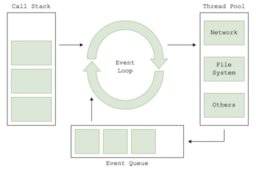
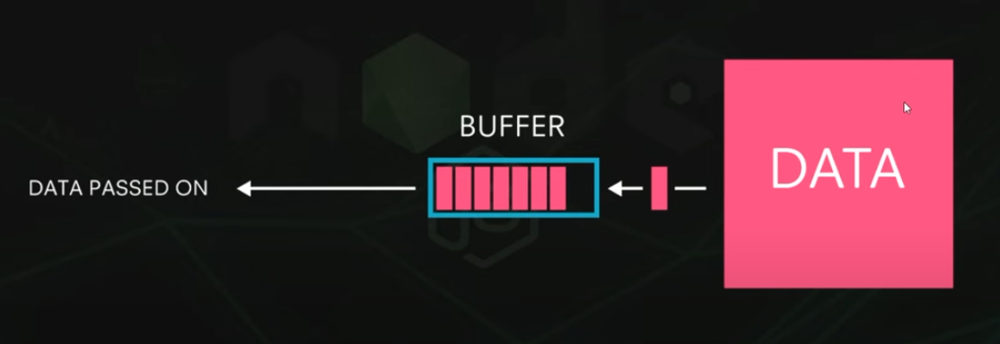
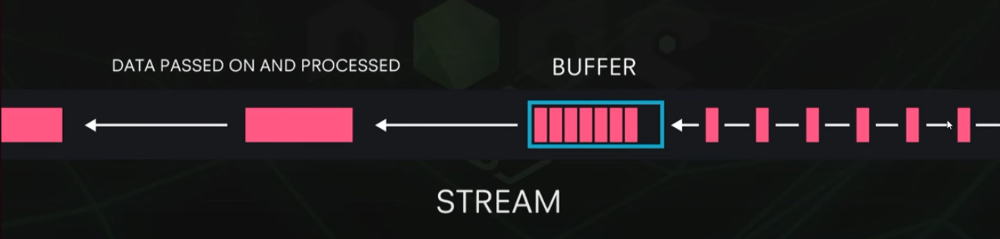
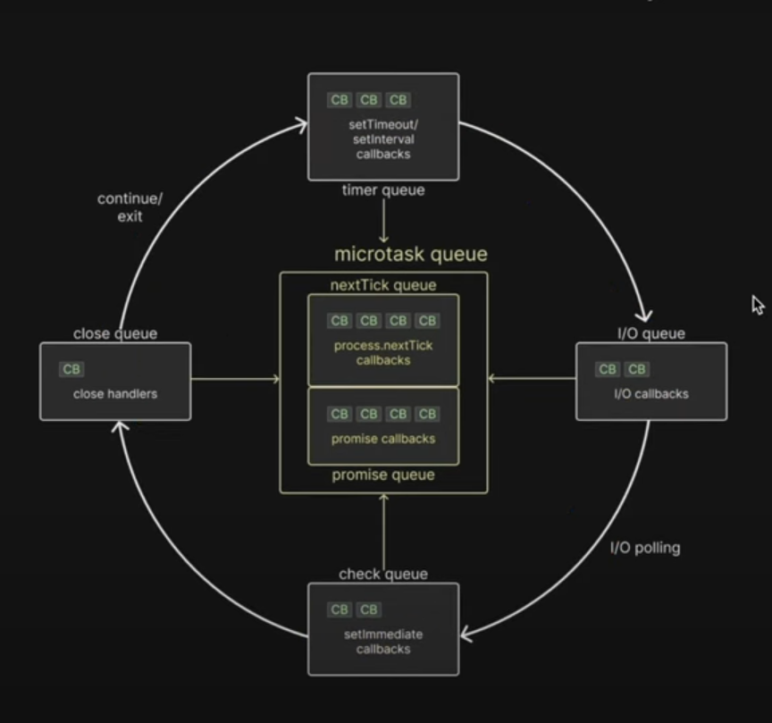

# Node JS

## What is Node JS?

Node JS is neither a language nor a framework. It is a runtime environment for executing Javascript code on the
server-side. The runtime environment is responsible for conversion of high language code to machine language code and
memory management. So, Express JS is a framework that uses Node JS to execute Javascript code on the server side.

## What is a framework?

A framework is a wrapper over the runtime environment. Which eases the development process by providing built-in
methods.

## How does Javascript run on client-side and server-side?

On client-side browsers use the V8 engine to run Javascript code. On the server-side Node JS uses the V8 engine to run
Javascript code.

## How does a network request from client-side to the browser-side work?

A user opens a browser and hits the client-side server. There user can perform basic operations on the client-side like
filtering, sorting, and to perform those operations a request will go to the server-side  
where Node JS and Express JS check the request and then fetch the data from the database and sends it to the client-side
which is then presented to the UI on the browser.

## Main features of Node JS?

1. Single Threaded
2. Non Blocking I/O
3. Event-Driven Architecture

## What is single-threaded?

A single-threaded performs only one task at a time.

## How does Node JS handle multiple tasks if it is a single-threaded language?

In Node JS, asynchronous flow can be achieved by its single-threaded, non-blocking, and event-driven architecture.  
Suppose, if there are 4 tasks (Task1, Task2, Task3, Task4) to be completed for an event. Then below steps will be
executed:  
**_First, Thread T1 will be created_**.  
Thread T1 initiates Task1, but it won't wait for Task1 to complete. Instead, T1 proceeds to initiate Task2, then Task3
and Task4 meanwhile the **libuv's worker threads are reposible to run the async tasks** (This asynchronous execution
allows T1 to efficiently handle multiple tasks concurrently).  
**_Whenever Task1 completes, an event is emitted_**. Thread T1, being event-driven, responds to this event, interrupting
its current task and delivering the result of Task1. And then proceeds with whatever it is doing.

## When not to use Node JS?

It would be best not to use Node JS when the application demands CPU-intensive tasks like image/ video processing.

## What is a Module in Node JS?

A module is basically representing a functionality (like user authentication, orders, payments, shipping) that can be
easily reused within an application.  
Ideally, In Node JS we represent individual files as modules.

## How to import module data?

```js
const moduleData = require("./moduleData")
import moduleData from "./moduelData"
```

## What is the module wrapper function?

In Node JS each module is wrapped in a function called the **module wrapper function**. Such that app.js is wrapped in a
function and when we run node app.js the file is executable.

## How many types of modules are there in Node JS?

There are three types of modules in Node JS.

1. Built-in Modules (File, HTTP, Path, Math)
2. Local Modules (Which we develop in our project)
3. Third-Party Modules (Lodash)

## Explain how the request is handled from the back-end side?

When a request is generated from the front-end server upon receiving it from the back-end server an event is triggered
and for that particular event, a function  
is called. After the completion of that function a response is sent back to the front-end server.

## What is the role of the HTTP module in Node JS?

An HTTP module creates an HTTP server that listens to HTTP requests.

## List some of the advantages of Express JS?

1. Simplified Web Development
2. Middleware Support
3. Flexible Routing System
4. Template Engine Integration

## What is a middleware?

A middleware is a function that sits between the request and the response. It can perform operations on the incoming
request or the outgoing response, and then pass control to the next middleware in line.

## What is the role of app.use() method?

The app.use(middleware) method is used to execute the middleware functions globally (for every request).

## What is the role of the next parameter?

The next parameter is a callback function which is used to pass control to the next middleware function in the stack.

## How many types of middleware are there?

1. Application Level app.use((req, res, next) => {});
2. Router Level app.use('/example', (req, res, next) => {});
3. Error-handling app.use((err,req,res,next)=>{});
4. Built-in app.use(express.static("public"));
5. Third-party app.use(bodyParser.json());

## If you have 5 middleware then in which middleware you will do the error handling?

I will do the error handling in the **last middleware** because suppose the error is generated in the 3rd middleware and
our error middleware is located at the second position and when the Node tries to trigger the error middleware it will
not be able to find the error middleware.

## Example of routing in Express JS?

```js
app.get("/orders/:orderId", (req, res) => {})
or
app.get("/orders/:orderId", ordersController.getOrderById)
```

## What is a router method? And why do we need it?

A router method is imported from express and by using it we can import/export our routes from a separate file.

```js
const router = express.Router()
router.get("/orders/:orderId", (req, res) => {})
module.exports = router

// and we can import it by using this syntax
const router = require("./router")
app.use("/api", router)
```

## Differences between app.get() and router.get() methods?

Routes defined using app.get() are automatically mounted on the **root path "/"** while routes defined using
router.get() must be explicitly mounted using **app.use()** method.

## What are template engines?

Template engines are used to combine static HTML pages with the dynamic data on the server side.

    1. EJS (Embedded JavaScript)
    2. Handlebars
    3. Pug

## What is REST?

REST stands for Representational State Transfer. Meaning transfer of data in a meaningful way. It is basically set of
rules for transferring the data.

    1. Separation of Client and Server
    2. Stateless (The server should not store the data)
    3. Cacheable (The response can be cacheable for similar requests)

## What is RESTful API?

An API which follows rest principles.

## What are HTTP methods and HTTP verbs?

GET, POST, PUT, PATCH and DELETE are known as HTTP methods or HTTP verbs.

## What is the difference between PUT and PATCH method?

The PUT method is used to update the resource completely or create a new one if not exists but PATCH method updated the
resource partially.

## What is Idempotence in RESTful API's?

Idempotence means performing an operation multiple times will have the same output. Idempotence methods are GET, PUT,
PATCH, DELETE while POST is not idempotent.

## HTTP Status Codes 1XX (Info):

- 100: Continue

### 2XX (Success):

- 200: OK
- 201: Created

### 3XX (Redirection):

- 300: Multiple Choices

### 4XX (Client Error):

- 400: Bad Request
- 401: Unauthorized
- 403: Forbidden
- 404: Not Found

### 5XX (Server Error):

- 500: Internal Server Error
- 502: Bad Gateway
- 503: Service Unavailable

## What are CORS?

CORS stands for Cross Origin Resource Sharing. Meaning sharing of data across different origins.

By default, browsers enforce something called the **Same-Origin Policy**.

Same protocol + same domain + same port.

By enabling CORS you can share the data across different origins.

## What is Serialization and Deserialization?

Serialization means the conversion of the JS object to JSON format. Deserialization is the vice versa.

```js
const JSONStr = JSON.stringify(obj)
const obj = JSON.parse(JSONStr)
```

## Types of Authentication

1. Basic Authentication (password as plain text)
2. API Key Authentication (API key is sent with the headers)
3. Token Based Authentication (JWT) (Token is sent with the headers) (Contains Header, Payload and Signature)
4. Multi-factor Authentication (MFA): Requires two or more verification factors to gain access. It combines:
   - **Something you know:** (Password/PIN)
   - **Something you have:** (Phone/OTP/Security Key)
   - **Something you are:** (Fingerprint/Face ID)
5. Certificate-based Authentication

## Handle Errors in Node JS

    1. Try Catch
    2. Error First Callbacks
    Passing error method as a callback to a function
    const errorFirstCallback = (error, result) => {};
    const asyncOperation = (callback)=>{};
    asyncOperation(errorFirstCallback);
    3. Using Promises
    4. Using Async/ Await and Try/Catch

How does Node.js handle child threads?

Node.js has introduced the concept of Worker Threads and Child Processes to help with parallel processing.

Worker Threads Node.js is capable of handling I/O operations efficiently. However, when it runs into any compute-heavy
operation, it causes the primary event loop to freeze up.



When Node.js discovers an async operation, it ״offshores״ it to the thread pool. However, when it needs to run a
compute-heavy operation, it performs it on its primary thread, which causes the app to block until the operation has
finished.

It does this by spinning up an isolated Node.js context that contains its own Node.js runtime, event loop, and event
queue, which runs in a remote V8 environment. This executes in a disconnected environment from the primary event loop,
allowing the primary event loop to free up.

Child Processes Child processes are different from worker threads. While worker threads provide an isolated event loop
and V8 runtime in the same process, child processes are separate instances of the entire Node.js runtime. Each child
process has its own memory space and communicates with the main process through IPC (inter-process communication)
techniques like message streaming or piping (or files, Database, TCP/UDP, etc.).

When should you use Worker Threads and Child Processess in Node.js?

Use worker threads when: You're running CPU-intensive tasks. If your tasks are CPU-intensive, worker threads are a good
choice. Your tasks require shared memory and efficient communication between threads. Worker threads have built-in
support for shared memory and a messaging system for communication.

Use child processes when: You're running tasks that need to be isolated and run independently, especially if they
involve external programs or scripts. Each child process runs in its own memory space. If the child process crashes for
some reason, it will not crash your main process along with it.

Difference between Async and Worker threads?

Async is used for time consuming tasks like API calling while worker threads are used for high computational tasks which
require processing power like data processing.

What are clusters in Node JS?  
Clusters in Node JS are used to run multiple instances of Node JS that can distribute workloads among their application
threads. Every instance of Node JS is then called a worker thread. The count of worker threads depends on the number of
cores in the CPU. The primary cluster works as a load balancer that assigns tasks to other worker threads. The algorithm
it used to assign tasks to worker threads is Round Robin algorithm (1234,1234,1234)

```javascript
const cluster = require("cluster")
const os = require("os")
const express = require("express")

const PORT = 8000
const totalCPUs = os.cpus().length

if (cluster.isPrimary) {
  for (let i = 0; i < totalCPUs; i++) {
    cluster.fork()
  }
} else {
  const app = express()
  app.get("/", (req, res) => {
    return res.json({
      message: `Hello from Express Server ${process.pid}`
    })
  })

  app.listen(PORT, () => {
    console.log(`Server Started At Port ${PORT}`)
  })
}
```

Difference between CSR, SSR? In Build Process, first the source code gets build and the files gets stored on the server.
Later, the data is sent to the client side.

In Client-Side Rendering (CSR), an empty HTML shell is sent to the client, followed by JavaScript files. The JavaScript
then dynamically generates the HTML, applies CSS, and loads content, enabling the page to render. For SEO purposes it is
not good as search engines might not fully load JavaScript, seeing an empty page instead of important content.


In Server-Side Rendering the web page gets rendered on the server and the rendered web page is sent to the client-side.
Every time a user request something from the server a rendered web page is sent to the client-side. As the server is
really powerful as compared to client computers or mobile devices the web pages gets rendered quickly.


How to optimize the SQL query?

1. Use idexing for searching or for commonly used columns in where conditions.
2. Try to avoid the use of SEELCT \*
3. Try to use varchar/ nvarchar instead of char as char adds trailing spaces.
4. Use numeric fields to store numeric values.
5. Try to minimize the use of DISTINCT keyword.
6. Try not to use the <> or != operator instead use the equality operator for better indexing.
7. Use EXISTS() keyword instead of COUNT() to discover whether the table has a specific record otherwise it will scan
   the whole table.

Queues In Node JS

Queues are used to run a backend task asynchronously. They’re essential for managing operations that can’t be completed
instantly. Mostly Message Queues and Task Queues are used.

1. Task Queues are used to manage and execute background jobs within the same application, often for things like sending
   emails, processing images, or handling long tasks. We basically pushed the tasks onto a queue and that task will run
   seperately after some time intervals.

2. Message Queues are used to send messages between different services or applications, allowing them to communicate
   without being directly connected.

What is Dependency Injection? Dependency Injection allows the application to inject a class dependencies into another
class whenever the framework needed the instance. The class/ service that is injected act as a dependency to the other
class. It depends on the IOC (Inversion Of Control) Principle. The control to manage the application is handed over to
the Framework. The IoC container holds all injectors, which use providers to define how dependencies (classes or
services) are created or retrieved. The class that wants to inject the other class will use the injection token to
import the dependencies.


Types of the Dependency Injections

1. Constructor Injection
2. Propery Injection

Authentication Process in MERN stack? In a MERN stack authentication process, users register by sending credentials
(like email and password) from the React frontend to the Node.js/Express backend, where passwords are securely hashed
(e.g., using bcrypt) before being stored in MongoDB. During login, credentials are verified, and upon success, the
backend generates a JWT (JSON Web Token) using a secret key, which is sent back to the frontend. The frontend stores the
token (preferably in an HTTP-only cookie or local storage) and includes it in subsequent requests for accessing
protected resources. On the backend, middleware validates the token, ensuring authorized access to specific routes.
Logout involves clearing the token on the client side.

What happens when someone changes the token. A JWT token is created based on the header + payload + secret key. The
token contains the following parts: header, payload, and signature. If someone changes the payload with their own secret
key, then it will result in a new signature for the token. When this modified token is sent to the server, the server
recalculates the signature using the token's header + payload and the server's own secret key. The recalculated
signature is then compared with the signature in the token that was sent to the server. If the signatures do not match,
the server identifies the token as tampered or invalid and rejects it.

What are Http-only Cookies? HTTP-only cookies are cookies with the HttpOnly attribute. They cannot be accessed via
client-side JavaScript, reducing the risk of XSS attacks where malicious scripts attempt to steal sensitive data stored
in cookies. HTTP-only cookies are stored in the browser's cookie storage, not in localStorage or sessionStorage.

When the server sets an HTTP-only cookie, it sends it in the Set-Cookie header as part of the response.

```javascript
res.cookie("token", jwtToken, {
  httpOnly: true,
  secure: true, // Only over HTTPS
  sameSite: "Strict", // CSRF protection
  maxAge: 3600000 // Cookie expiry in milliseconds
})
res.json({ message: "Logged in successfully" })
```

Once the cookie is set, the browser automatically attaches it to all subsequent requests.

```javascript
const token = req.cookies.token // Extract token from HTTP-only cookie
```

What is CSRF attack? A CSRF (Cross-Site Request Forgery) attack happens when a hacker takes advantage of your active
session with the website to perform actions as if you were doing them yourself.

Use csurf or use the same-site attribute to prevent from these attack

```javascript
const csrf = require("csurf")
const csrfProtection = csrf({ cookie: true }) // Use with cookies
app.use(csrfProtection)
```

What is Rate Limiting? Rate limiting is a technique used to control the number of requests a client (e.g., IP address,
user) can make to a server within a specific period. It helps prevent abuse or overuse of APIs, protects against DDoS
(Distributed Denial-of-Service) attacks, and ensures fair use of resources. Each request is identified by a unique key
(e.g., IP address, user ID). The server keeps track of the number of requests made by this key.

What is a DDoS Attack? A DDoS (Distributed Denial-of-Service) attack is a malicious attempt to disrupt the normal
operation of a server, service, or network by overwhelming it with a flood of internet traffic.

What is Refresh Token? When a JWT is initially generated, a Refresh Token is also created and sent to the client. The
client securely stores the JWT and Refresh Token—ideally, the Refresh Token in an HttpOnly cookie to protect against XSS
attacks. For each subsequent request, the client includes the JWT in the request header (typically as a Bearer token)
for authentication. If the JWT expires, the client sends the Refresh Token in a secure request (such as via an HttpOnly
cookie) to the server to request a new JWT. The Refresh Token typically has a longer expiration period compared to the
JWT

What are buffers and streams in Node JS? Buffer contains small chunks of data that are stored temporarily and can be
transferred from one place to another. 

However, stream contains chunks of buffered data that can be transferred from one place to another.


Types of Streams in Node JS? There are four types of streams in Node JS:

1. Readable Stream Readable Stream is used to read data from a source in the form of chunks.

```js
const readableStream = fs.createReadStream("example.txt", "utf8")

readableStream.on("data", (chunk) => {
  console.log("Received chunk:", chunk)
})
```

2. Writable Stream Write data to a destination in the form of chunks

```js
const writableStream = fs.createWriteStream("output.txt")
writableStream.write("Hello, world!\n")
```

3. Duplex Stream Acts as both Readable and Writable.

4. Transform Stream A special type of Duplex stream that modifies data while reading and writing.

Why Use Streams? Efficient memory usage (no need to load entire files into memory). Faster processing (handles chunks of
data as they arrive). Used in handling files, network communication, and real-time processing.

How would you define the term Non Blocking I/O? Node.js uses an event-driven, non-blocking I/O model, meaning it can
handle multiple I/O operations concurrently without waiting for each one to complete.

What does event-driven programming mean? Event-driven architecture (EDA) is a way of designing software where different
parts of a system communicate by sending and responding to events. Imagine you are waiting for a guest at home. Instead
of constantly checking the door, you wait for the doorbell (event) to ring.

Parts of the event-driven programming: Event Producer: Something happens (e.g., a user clicks a button, a payment is
made). Event Broker: A middle layer that helps send the event to the right place. Event Consumer: A system or service
that listens for the event and reacts (e.g., sending an email confirmation after payment).

What is an Event Loop in Node.js? Event Loop ensures asynchronous code runs without blocking execution. The Event Loop
acts as a bridge between the Call Stack and the Callback Queue. It constantly checks: Is the Call Stack empty? If yes,
it takes data from the relevant queue and pushes it to the Call Stack.

Also Event Loop runs in multiple phases.

1. Timers Phase (setTimeout, setInterval)
2. Callbacks Phase
3. Idle/Prepare Phase (Used for internal operations)
4. Pool Phase (Retrieves new I/O operations)
5. Check Phase (setImmediate)
6. Close Callbacks Phase



Example For Event Loop Imagine a restaurant with a waiter (event loop), customers (tasks), and a kitchen (processing
unit).

A customer (task) arrives and places an order (request). The waiter (event loop) takes the order and gives it to the
kitchen (processor). Instead of waiting for the kitchen to finish cooking, the waiter takes another order from a
different customer. When the kitchen is done with an order, it notifies the waiter. The waiter then serves the completed
order to the respective customer.

How many Queues are present in the NodeJS? The main types of queues are:

1. Macrotask Queue (Task Queue) Contains tasks that come from: setTimeout setInterval setImmediate (Node.js) I/O
   operations (e.g., file reading, network requests) UI rendering tasks (in browsers) MessageChannel

2. Microtask Queue (Job Queue) Contains higher-priority tasks executed before the next macrotask. Includes: Promises
   (.then, catch, finally)

3. Render Queue (Browser-specific) Handles rendering tasks like UI updates in web browsers. Runs between different
   macrotask executions.

Differentiate between process.nextTick() and setImmediate()? In Node.js, process.nextTick() and setImmediate() are both
used to schedule callbacks, but they execute at different phases of the event loop.

process.nextTick() The process.nextTick() method is used to schedule a callback to be executed before the event loop
moves to the next phase.

setImmediate() Executes callbacks in the check phase of the event loop, after I/O operations.

```javascript
console.log("Start")

process.nextTick(() => {
  console.log("process.nextTick callback 1")
  process.nextTick(() => {
    console.log("process.nextTick callback 2")
  })
})

setImmediate(() => {
  console.log("setImmediate callback")
})

console.log("End")
```

```
Output:
Start
End
process.nextTick callback 1
process.nextTick callback 2
setImmediate callback
```

What is Libuv? libuv is the underlying C library that Node.js uses to implement the event loop. libuv does not executes
tasks directly it manages asynchronous tasks (like timers, I/O, and network requests) and places their callbacks in the
event queues when they are ready.

What is REPL in Node.js? REPL stands for Read-Eval-Print Loop in Node.js. It is an interactive environment that allows
you to execute JavaScript code directly in a command-line interface. To start the REPL, simply open a terminal and run:
node

Read – Reads user input. Eval – Evaluates the input JavaScript code. Print – Prints the result of the evaluation. Loop –
Loops back to read the next input.

What is piping in Node.js? Piping is a mechanism in Node.js that allows data to be passed from one stream to another. It
is commonly used to read data from a readable stream and send it to a writable stream.

```javascript
const fs = require("fs")

const readableStream = fs.createReadStream("input.txt")
const writableStream = fs.createWriteStream("output.txt")

readableStream.pipe(writableStream)

console.log("File copied successfully!")
```

What is callback hell (pyramid of doom)? Callback Hell occurs in JavaScript (especially in Node.js) when multiple nested
asynchronous callbacks make code unreadable and difficult to maintain.

Example:

```javascript
fs.readFile("file1.txt", "utf8", (err, data1) => {
  if (err) return console.error(err)

  fs.readFile("file2.txt", "utf8", (err, data2) => {
    if (err) return console.error(err)

    fs.readFile("file3.txt", "utf8", (err, data3) => {
      if (err) return console.error(err)

      console.log("All files read successfully!")
    })
  })
})
```

Solution is to use promises .then() or async and await

What is typically the first argument passed to a Node.js callback handler? In Node.js, the first argument passed to a
callback function is typically an error object (commonly named err).

```javascript
const fs = require("fs")

fs.writeFile("example.txt", "Hello, Node.js!", (err) => {
  if (err) {
    console.error("Error writing to file:", err)
    return
  }
  console.log("File written successfully!")
})
```

How do you handle file uploads in Node.js? To handle file uploads in Node.js, you typically use Express.js with a
middleware like multer for processing multipart/form-data (used in file uploads).

What is a first-class function in Javascript? A first-class function in JavaScript means that functions are treated like
any other value. They can be:

1. Assigned to variables
2. Passed as arguments to other functions
3. Returned from other functions

```javascript
// Assigning an arrow function to a variable
const greet = (name) => `Hello, ${name}!`

// Passing a function as an argument
const executeFunction = (callback) => console.log(callback("Alice"))

// Returning a function from another function
const outer = () => (name) => `Goodbye, ${name}!`

// Using all cases together
const inner = outer() // inner is now a function
executeFunction(greet) // Calls greet function
console.log(inner("Bob")) // Calls the returned function
```

```
Hello, Alice!
Goodbye, Bob!
```

What is an EventEmitter in Node.js? Many things in Node.js are event-driven. Events are like signals, and the
EventEmitter module is used to create, listen to, and trigger custom events.

```javascript
const EventEmitter = require("events")
const eventEmitter = new EventEmitter()

const printName = (name) => {
  console.log(`Hello, ${name}!`)
}

eventEmitter.on("greet", printName)
eventEmitter.emit("greet", "Alice")
eventEmitter.off("greet", printName)
```

How do you debug a Node.js application? Video Tutorial in Hindi https://www.youtube.com/watch?v=ioOWMmF3wMo

To Check in VS Code

1. Create a launch.json file and select Node.js
2. Change Configuration
3. Add Breakpoint
4. Click on Run and Debug

To Check in Chrome

1. Run the index.js file with node inspect index.js command
2. Open chrome and hit the chrome://inspect url
3. Click the inspect link

Can you access DOM in Node.js? No, Node.js cannot access the DOM (Document Object Model).

1. Node.js runs on the server – It does not have a built-in browser environment.
2. The DOM is a browser feature – It is part of the web APIs provided by the browser (like window, document).
