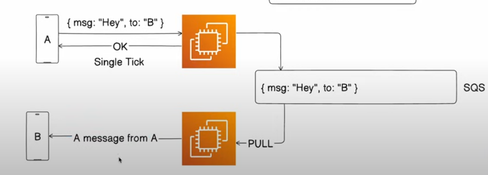
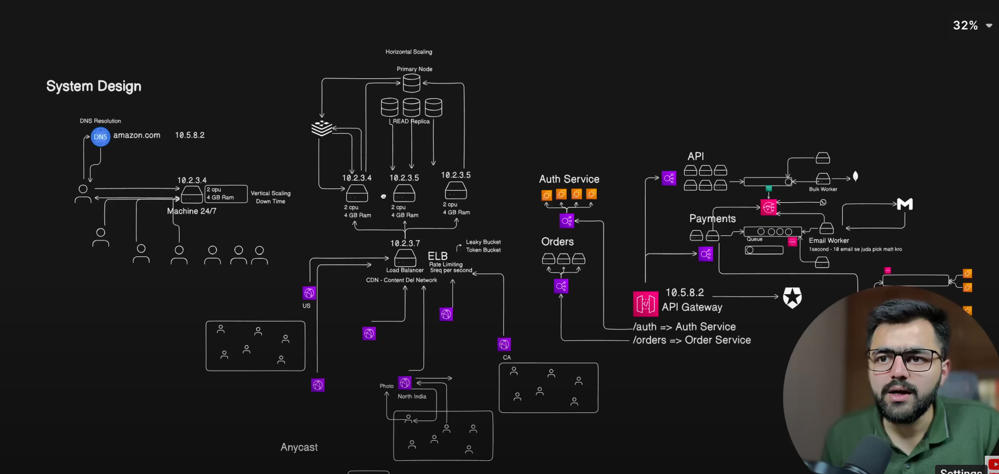

EC2 EC2 stands for Elastic Compute 2 which is a kind of server where we deploy our application code.

If the load increases on the server will you increase the servers by Auto Scaling Group Policy (ASGP) (Horizontal
Scaling) or will you do anything else?

We can identify critical and non-critical tasks and seggregate them. The critical tasks will be handled by the server
like Payment tasks, but not critical tasks (sending email for successful payment) can be send to a queue and we can set
up a consumer on a queue which is a seperate server.

Always identify critical and non-critical tasks. For critical tasks they need to be done synchronously (can be handled
by the server) and non-critical can be done asynchronously (can be handled by the queue).

Server

Server is basically a machine which is available 24/7 and it has a public IP address through which we can access it.

DNS

DNS is a global directory which stores the domain name against the IP addresses.

DNS resolution

The process where the request goes to the DNS server and finds the IP against the domain and returns the IP address.

Vertical Scaling and Horizontal Scaling

We increase the hardware resources of a machine. And Horizontal Scaling is creating a new server in parallel of existing
server.

We rush increases in vertical scaling the machine needs to reboot to scale up its resources its one of the disadvantage
of vertical scaling.

Load Balancer

Load Balancer basically reroutes the load to multiple server. The IP of load balancer is assigned to the DNS server such
as the client hit every time the IP of Load Balancer.

Load balancer mostly works on Round Robin fashion. If we have two servers first request goes to the first server second
request goes to the second server and third request goes to the first server again and so on.

API Gateway

API Gateway is a service that is used to reroute the load to different services. Where each service can have its own
load balancer.

SQS Queue

SQS (Simple Queue Service) queue is used to separate services from each other. By using this, we can push events inside
the queue and other services can pull events from the queue whenever they are free. This means the first service that is
sending the events is decoupled and doesn't need to wait for a response from the receiving service.

An event send to SQS queue can only be listen by only one worker not by other workers. In queue system we have the
acknowledgment that the message is received.

Pub/Sub (SNS)

In pub/sub architecture an event can be listen by other workers too. It is published from one place and subscribed by
multiple. In event driven architecture we don't have the acknowledgment that the message is received.

Rate Limiting How many request can be send in a given amount of time.

Redis

We cache the data retrieved from the database in Redis. When a request is made, we first check if the data exists in
Redis. If it does, we return it directly. Otherwise, we fetch the data from the database, store it in Redis for future
requests, and then return it to the user.

CDN (CloudFront)

A Content Delivery Network (CDN) is a geographically distributed network of servers that work together to deliver web
content. Basically each server is linked with the Load Balancer and same IP can be assigned to all these server by using
AnyCast. It works something like Redis such as when a request is made from a particular region the data gets saved
inside the CDN for that region and when a new request is made it is fetched from the CDN rather going towards the Load
Balancer and then the main server.

Can we use the same architecture for every product?

No, we cannot use the same architecture for every product. Each product has different needs and features, so they
require different designs. For example, YouTube and Netflix have different architectures because they serve different
purposes and handle data in their own ways.

Serverless (The cloud manage the architecture)

Serverless means you don't have to set up or look after servers yourself. For example, in AWS, a service called Lambda
runs your code for you. If more people use your app, AWS will automatically run more copies of your code. When fewer
people use it, AWS stops the extra copies. You just write code, and AWS takes care of the CPU, RAM, auto scaling in the
background. You just give the code to AWS and AWS will handle it by itself.

Cons of using Lambda

1. Cold Start (Lambda takes time to start)
2. You are bind in the AWS ecosystem
3. They are stateless (No data can be stored on the server as they destroy after sometime)

Difference between Virtualization and Containerization? In Virtualization, we run a virtual machine inside another
machine. Like a OS running inside another OS.

In Containerization, it is also a virtual machine but really lightweight.

Container Orchestration (Kubernetes) It resolves multiple problems like management of multiple containers on different
servers, auto-deployment and scaling.
